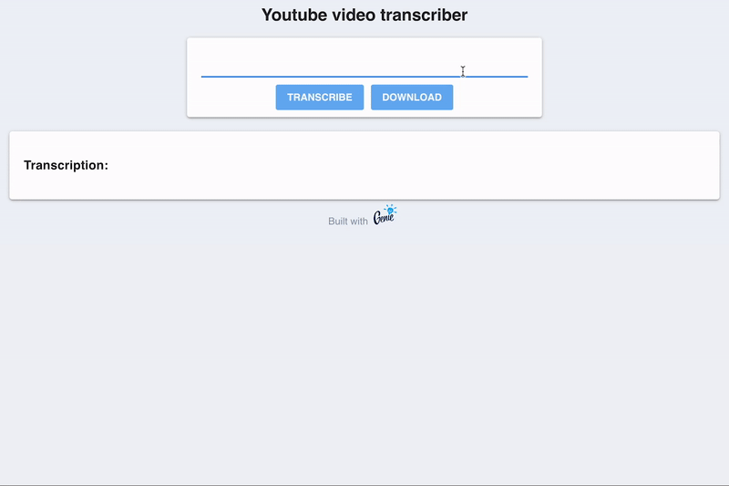

## Youtube video transcriber

Transcribe audio from Youtube videos using [Whisper.jl](https://github.com/aviks/Whisper.jl), a Julia package for Automatic Speech Recognition (ASR) that leverages OpenAI's Whisper model.



Requeriments:
- `yt-dlp` for downloading and extracting the audio.
- `ffmpeg` for transcoding the audio.

Usage:
- First, download the audio of the video with the "Download" button.
- Next, transcribe the audio with the "Transcribe" button. This can take a while.
- To use a different [Whisper model](https://github.com/aviks/Whisper.jl), edit the call to `transcribe` in `whisper.jl`

## Local installation

Clone the repository and install the dependencies:

First `cd` into the project directory then run:

```bash
$> julia --project -e 'using Pkg; Pkg.instantiate()'
```

Then run the app

```bash
$> julia --project
```

```julia
julia> using GenieFramework
julia> Genie.loadapp() # load app
julia> up() # start server
```

## Usage

Open your browser and navigate to `http://localhost:8000/`

## Running in Docker

The Docker image for this app is available available at `pjgim/whisper` and can be run with

```
docker run -p 8000:8000 pjgim/whisper
```

You can also build your own with the included Dockerfile.


